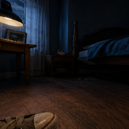

<p align="center">
  
</p>

<h1 align="center">SmallDream</h1>

<p align="center">
  <strong>A 3D first-person adventure game built in C++ and OpenGL where you explore a giant house at toy size, solve puzzles, and uncover the mystery of a dream world.</strong>
</p>

<p align="center">
  <a href="https://github.com/Kevin8775/SmallDream/stargazers"></a>
  <a href="https://github.com/Kevin8775/SmallDream/network/members"></a>
  <a href="https://github.com/Kevin8775/SmallDream/issues"></a>
  <a href="https://github.com/Kevin8775/SmallDream/commits/main"></a>
  
  
  
</p>

---

## Table of Contents

- [Project Description](#project-description)
- [Installation](#installation)
- [Usage](#usage)
- [Game Features](#game-features)
- [Architecture](#architecture)
- [Credits](#credits)
- [License](#license)
- [Contributing](#contributing)
- [Tests](#tests)

---

## Project Description

**SmallDream** is a 3D first-person adventure game developed as an academic project. The player awakens having shrunk to the size of a toy inside a giant house. They must explore rooms, overcome obstacles, solve puzzles, and uncover the mystery of the dream world.

### Motivation

This project was built to explore core game development concepts in C++ and OpenGL, including:

- **Finite State Machine architecture** for managing complex game flows (17 distinct states)
- **3D rendering pipelines** with Phong lighting, cubemap skyboxes, and fog effects
- **Physics and collision detection** using octree spatial partitioning and sphere-mesh tests
- **AI behavior** for enemy agents in stealth/survival mini-games
- **Visual novel storytelling** integrated into a 3D environment
- **Bilingual localization** (Spanish/English) with runtime language switching

### Challenges Faced

- **Monolithic architecture**: The main game loop resides in a single ~2,164-line `main.cpp`, making maintenance difficult. Future iterations should modularize into ECS or component-based patterns.
- **Single-platform dependency**: Built exclusively for Windows with MSBuild/Visual Studio. Cross-platform support (Linux, macOS) would require CMake migration.
- **No automated testing**: All testing is manual through gameplay. Unit tests for collision, localization, and state transitions are planned.
- **Asset pipeline**: 3D models (glTF 2.0), textures, and shaders are manually managed. A proper asset pipeline with hot-reloading would improve iteration speed.

### Future Features

- [ ] Migrate to CMake for cross-platform builds
- [ ] Implement Entity-Component-System (ECS) architecture
- [ ] Add automated unit and integration tests
- [ ] Support additional languages (French, Portuguese)
- [ ] Add Vulkan rendering backend as an alternative to OpenGL
- [ ] Implement proper save/load game system
- [ ] Add particle effects and post-processing shaders

### Technology Stack

| Category | Technology |
|----------|------------|
| Language | C++17 (MSVC v145) |
| Graphics API | OpenGL 3.3 Core Profile |
| Window/Input | GLFW3 |
| GL Loader | GLAD |
| Math Library | GLM |
| 3D Model Loading | Assimp |
| Font Rendering | FreeType |
| Image Loading | stb_image |
| Audio | miniaudio |
| Package Manager | vcpkg |
| Build System | MSBuild / Visual Studio 2022 |
| Shader Language | GLSL 3.30 core |
| Model Format | glTF 2.0 |

---

## Installation

### Prerequisites

- **Visual Studio 2022** (v145 platform toolset, targeting Windows 10 x64)
- **vcpkg** installed and integrated with Visual Studio
  ```powershell
  git clone https://github.com/microsoft/vcpkg.git
  cd vcpkg
  .\bootstrap-vcpkg.bat
  .\vcpkg integrate install
  ```

### Setup

1. **Clone the repository**
   ```bash
   git clone https://github.com/Kevin8775/SmallDream.git
   cd SmallDream
   ```

2. **Open in Visual Studio**
   - Open `SmallDream.sln` in Visual Studio 2022.
   - vcpkg will automatically resolve and install dependencies via the `vcpkg.json` manifest.

3. **Select build configuration**
   - Choose **Debug|x64** or **Release|x64** from the toolbar.

4. **Build the solution**
   - Press `Ctrl+Shift+B` or go to **Build > Build Solution**.
   - The build process automatically:
     - Copies the `assets/` directory to the output folder
     - Copies required vcpkg DLLs to the output folder

5. **Run the game**
   - Press `F5` or navigate to the output directory:
     - Debug: `bin/Debug/SmallDream.exe`
     - Release: `bin/Release/SmallDream.exe`

### Dependencies (auto-installed via vcpkg)

| Package | Purpose |
|---------|---------|
| `glfw3` | Window creation and input handling |
| `glad` | OpenGL function loading |
| `freetype` | TrueType font rasterization |
| `assimp` | 3D model import (glTF support) |
| `glm` | Mathematics (vectors, matrices, transforms) |
| `stb` | Image loading (stb_image) |

---

## Usage

### Controls

| Key | Action |
|-----|--------|
| `W` `A` `S` `D` | Move / Strafe |
| `Mouse` | Look around (first-person camera) |
| `Space` | Jump (double-jump in garage) |
| `Shift` | Sprint |
| `E` | Interact (doors, clues, panels) |
| `Q` | Open inventory (escape room) |
| `Escape` | Pause menu |
| `B` | Toggle collision debug overlay |

### Game Flow

The game progresses through 17 states:

```
Loading → Menu → StoryChoice → VisualNovel → CloudTransition
    → DreamLoading → DreamBlack → HouseWalk
        → RoomLoading → [Bodega | Bano | DormitorioEscape]
            → Credits
```

### Mini-Games

**1. Bodega (Storage Room)**
- Stealth/survival game against an AI enemy
- 60-second timer — survive until time runs out
- Features stamina/sprint mechanics and line-of-sight AI

**2. Bano (Bathroom)**
- Slippery platformer avoiding giant water drops
- Physics-based sliding, fog effects, and stun mechanics

**3. Dormitorio (Bedroom Escape Room)**
- Find 4 clue objects scattered around the room
- Enter the correct 4-digit code (`1945`) on the panel to escape
- Features an inventory system with proximity-based interaction

<!-- Add screenshot here: gameplay screenshot of house exploration -->
<!-- Add screenshot here: mini-game screenshot -->
<!-- Add screenshot here: visual novel dialogue scene -->

### Localization

- Toggle between **Spanish** and **English** from the main menu
- Language preference is saved to `language.cfg`
- All UI strings use a `TextId` enum with translations in the `Localization` module

---

## Architecture

### Project Structure

```
SmallDream/
├── SmallDream.sln              # Visual Studio solution
├── vcpkg.json                  # vcpkg dependency manifest
├── src/                        # C++ source code
│   ├── main.cpp                # Entry point, game loop, state machine
│   ├── Shader.cpp/.h           # OpenGL shader compilation
│   ├── Texture.cpp/.h          # 2D texture loading (stb_image)
│   ├── CubemapTexture.cpp/.h   # Skybox texture loading
│   ├── TextRenderer.cpp/.h     # FreeType text rendering (UTF-8)
│   ├── Menu.cpp/.h             # Main menu system
│   ├── Localization.cpp/.h     # Bilingual localization (ES/EN)
│   ├── VisualNovel.cpp/.h      # Visual novel dialogue system
│   ├── Model.cpp/.h            # 3D model loading (Assimp)
│   ├── MeshCollider.cpp/.h     # Collision detection (sphere-mesh)
│   ├── Octree.cpp/.h           # Spatial partitioning
│   ├── DebugRenderer.cpp/.h    # Debug wireframe rendering
│   ├── HouseScene.cpp/.h       # House scene management
│   ├── Door.h                  # Door/room transition data
│   ├── BodegaGame.cpp/.h       # Storage room mini-game
│   ├── BanoGame.cpp/.h         # Bathroom mini-game
│   └── EscapeRoom.cpp/.h       # Bedroom escape room
├── assets/
│   ├── shaders/                # GLSL shader files
│   ├── fonts/                  # Font files
│   ├── textures/               # 2D textures and skyboxes
│   ├── models/                 # 3D models (glTF 2.0)
│   └── sounds/                 # Audio files
├── bin/                        # Build output
└── obj/                        # Intermediate build files
```

### Rendering Pipeline

- Custom Phong lighting (ambient + diffuse + specular)
- Cubemap skyboxes (menu and house environments)
- Distance-based exponential fog
- Alpha blending for transparent elements
- FreeType text rendering with UTF-8 support

### Collision System

- **Octree** spatial partitioning for broad-phase collision
- **Sphere-mesh** intersection tests for narrow-phase
- **Grid-based** collision for mini-game environments
- Debug wireframe visualization (toggle with `B` key)

---

## Credits

### Team

| Name | GitHub | Role |
|------|--------|------|
| **Torres Guadamuz Miguel Angel** | [@MiguelTorres2610](https://github.com/MiguelTorres2610) | Primary Developer |
| **Torrez Urbina Kevin Gael** | [@Kevin8775](https://github.com/Kevin8775) | Co-Developer (Menu, UI, Models) |
| **Chavez Martinez Kevin Fernando** | [@Reversa2410](https://github.com/Reversa2410) | Contributor |

### 3D Model Assets

| Model | Author | License |
|-------|--------|---------|
| [Low poly suburban house](https://sketchfab.com/3d-models/low-poly-suburban-house-with-interior-6c6f1bff32064cd2ae8f58f751b76e70) | Azazel750 | CC-BY-4.0 |
| Bedroom model | See `assets/models/bedroom/license.txt` | CC-BY-4.0 |
| Garage model | See `assets/models/garage/license.txt` | CC-BY-4.0 |
| Enemy model | See `assets/models/enemy/license.txt` | CC-BY-4.0 |

### Libraries and Tools

- [GLFW](https://www.glfw.org/) — Window and input management
- [GLAD](https://glad.dav1d.de/) — OpenGL loader
- [GLM](https://github.com/g-truc/glm) — Mathematics library
- [Assimp](https://www.assimp.org/) — 3D model import
- [FreeType](https://www.freetype.org/) — Font rendering
- [stb](https://github.com/nothings/stb) — Image loading
- [miniaudio](https://miniaud.io/) — Audio playback
- [vcpkg](https://github.com/microsoft/vcpkg) — Package management

---

## License

**All Rights Reserved.**

This project and its source code are not licensed for public use, modification, or distribution without explicit permission from the authors.

**Note:** Third-party assets (3D models, fonts, sounds) may carry their own licenses. See individual `license.txt` files in `assets/models/` directories for details.

---

## Contributing

This project was developed as an academic assignment. While external contributions are not actively sought, we welcome feedback and suggestions.

If you'd like to report a bug or suggest a feature:

1. Fork the repository
2. Create a feature branch (`git checkout -b feature/your-feature`)
3. Commit your changes (`git commit -m 'Add your feature'`)
4. Push to the branch (`git push origin feature/your-feature`)
5. Open a Pull Request

Please ensure your code follows the existing style and includes appropriate comments.

---

## Tests

### Current Status

**Automated tests are not yet implemented.** The project currently relies on manual testing through gameplay.

### Manual Testing Checklist

- [ ] Game launches and displays loading screen
- [ ] Main menu renders with animated character sprite
- [ ] Language toggle switches between Spanish and English
- [ ] Visual novel scenes play correctly with dialogue
- [ ] House exploration with proper collision detection
- [ ] Door transitions load rooms correctly
- [ ] **Bodega mini-game**: enemy AI follows player, timer counts down
- [ ] **Bano mini-game**: slippery physics, water drops spawn
- [ ] **Escape room**: clues interactable, code entry works
- [ ] Pause menu functions correctly
- [ ] Credits scroll and display team information

### Future Testing Plans

- Unit tests for `Localization` module (string lookups, language switching)
- Unit tests for `MeshCollider` (sphere-mesh intersection math)
- Unit tests for `Octree` (spatial partitioning correctness)
- Integration tests for state machine transitions
- Performance benchmarks for rendering pipeline

---

<p align="center">
  Made with  and lots of ☕
</p>
